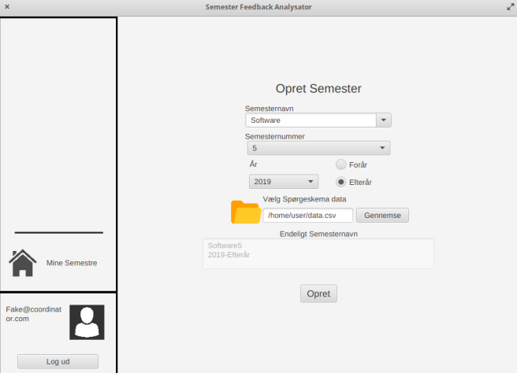
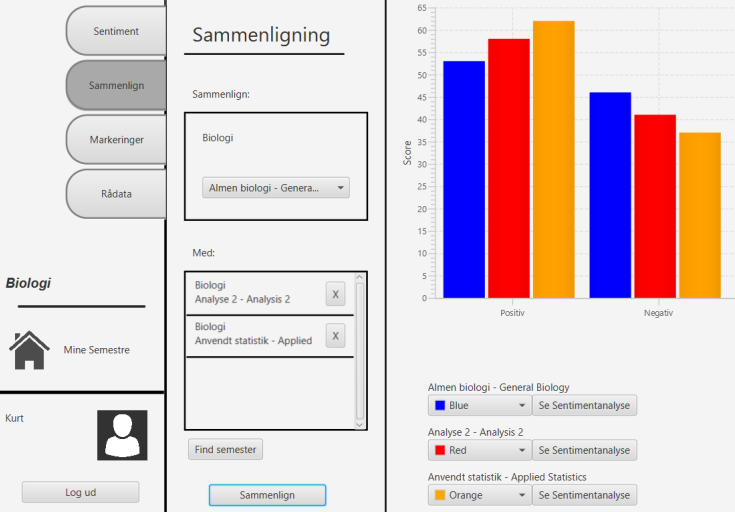
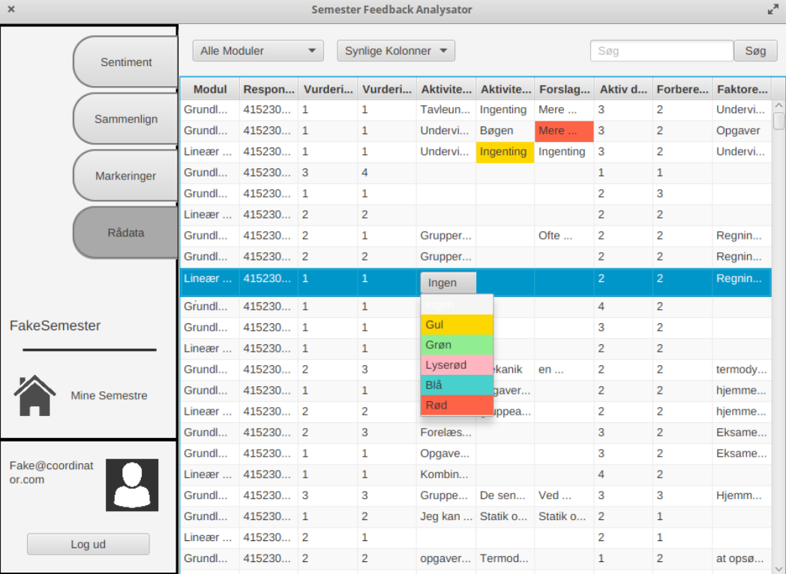

# Improvement In The Preparation Of Semester Evaluation Reports
The project sought to improve the evaluation process of the semester evaluations done by the semester coordinators. Feedback was categorized by the predicted sentiment which was found by using a combination of an lstm network and a statistical keyword approach. A JavaFX GUI was created to give an impression of how such a tool can be used. 

## Showing application
The following image illustrates how a new semester can be created by a semester coordinator:

This image shows how evaluations in different modules can be compared to each other:

This last image shows how the raw evaluation data can also be illustrated inside the platform:

# Group Members and Report:
Christian Graae Zandersen, Jesper Adriaan van Diepen, Mike Lund Andersen, Nanna Søgaard Andersen, Niki Zakariassen, Rasmus Lindegaard, Simon Steiner

[Report](Report.pdf)
